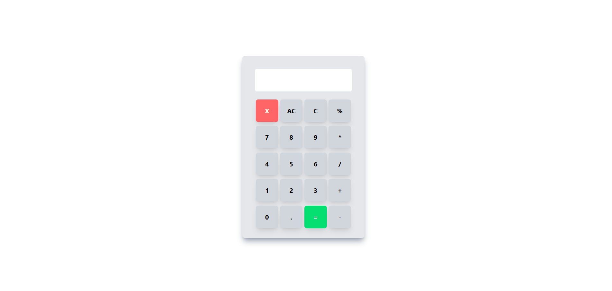

# Calculator

A user-friendly calculator built with HTML, CSS, and JavaScript, allowing quick and easy basic arithmetic operations.
## Screenshot

##  Technologies Used

- HTML
- CSS
- JavaScript
- Tailwind CSS
##  Features

- Perform Addition, Subtraction, Multiplication, and Division
- Clear button to reset input
- Responsive design works on desktop and mobile devices
- Interactive buttons for easy input
- Lightweight and fast

##  Usage

- Click on the number buttons to input digits.
- Use operator buttons (+, -, *, /) to perform calculations.
- Press = to see the result.
- Press C to clear the input.

## How It Works

- JavaScript handles button clicks and calculations.
- Numbers/operators appear in the input field.
- `=` evaluates the expression, `C` clears it.
- CSS and Tailwind CSS make it responsive and visually appealing.

